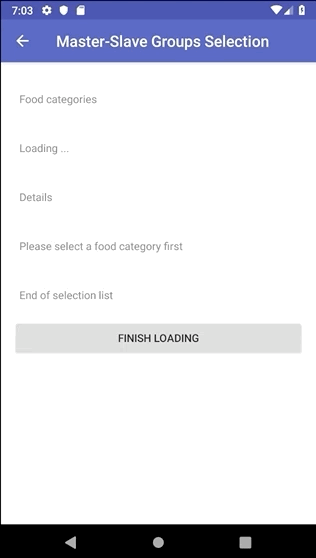

# Recycler Adapter [  ](https://bintray.com/gotev/maven/recycler-adapter/_latestVersion) [  ](https://search.maven.org/search?q=g:net.gotev)
#### [Latest version Release Notes and Demo App](https://github.com/gotev/recycler-adapter/releases/latest)

RecyclerView-driven declarative UIs.

Using stock Android View system and Recycler Adapter, you can already write UIs similar to [JetPack Compose](https://developer.android.com/jetpack/compose) and use it in production.

```kotlin
render {
    +Items.leaveBehind("swipe to left to leave behind", "option")

    (0..random.nextInt(200) + 50).map {
        if (it % 2 == 0)
            +Items.Card.titleSubtitle("Item $it", "subtitle $it")
        else
            +Items.Card.labelWithToggle("Toggle $it")
    }
}
```

Standard `RecyclerView.Adapter` is tedious to work with, because you have to write repetitive boilerplate and spaghetti code and to concentrate all your items view logic and binding into the adapter itself, which is really bad. This library was born to be able to have the following for each element in a recycler view:

* a `model`, which is a simple `data class`
* a programmatic `View` or an XML layout file, in which to define the item's view hierarchy
* a `view model` file (called `AdapterItem`), in which to specify the binding between the model and the view and in which to handle user interactions with the item.

In this way every item of the recycler view has its own set of files, resulting in a cleaner and easier to maintain code base.

## Examples
Before diving into some details, it's worth mentioning you can download and try those example apps which are using the library:
- [Recycler Adapter Demo App](https://github.com/gotev/recycler-adapter/tree/master/app)
- [Star Wars Api Demo App](https://github.com/gotev/swapi-android)

# Index

* [Setup](#setup)
* [Basic usage tutorial](#basicTutorial)
* [Diffing strategy](#diffingStrategy)
* [Stable IDs](#stableIDs)
* [Adding different kind of items](#differentItems)
* [Carousels and nested RecyclerViews](#carousels)
* [Paged Lists](#pagedLists)
* [Empty item](#emptyItem)
* [Empty item in Paged Lists](#emptyItemPagedLists)
* [Filter items (to implement searchBar)](#filterItems)
* [Sort items](#sortItems)
* [Using ButterKnife](#butterKnife)
* [Using Kotlin Android Extensions](#kotlinAndroidExt)
* [Reorder items with drag & drop](#dragDrop)
* [Handle clicks](#handleClicks)
* [Handle item status](#handleItemStatus)
* [Event lifecycle](#eventLifecycle)
* [Single and Multiple selection of items in groups](#itemsSelection)
* [Leave Behind pattern](#leaveBehind)
* [Lock scrolling while inserting](#lockScroll)
* [Contributors](#contributors)

## <a name="setup"></a>Setup
In your gradle dependencies add:
```groovy
def recyclerAdapterVersion = "x.y.z" // change it with the version you want to use
implementation "net.gotev:recycleradapter:$recyclerAdapterVersion"
```
This is the latest version: [  ](https://bintray.com/gotev/maven/recycler-adapter/_latestVersion)

Due to some prolonged Bintray outages, an alternative maven repo has been set. If the dependencies are not resolved, add this to your maven repos:

```groovy
maven {
    url "https://raw.githubusercontent.com/gotev/recycler-adapter/master/releases"
}
```

## <a name="basicTutorial"></a>Basic usage tutorial
### 1. Declare the RecyclerView
In your layout resource file or where you want the `RecyclerView` (e.g. `activity_main.xml`) add the following:
```xml
<androidx.recyclerview.widget.RecyclerView
    android:id="@+id/recycler_view"
    android:scrollbars="vertical"
    android:layout_width="match_parent"
    android:layout_height="wrap_content" />
```

### 2. Create your item layout
Create your item layout (e.g. `item_example.xml`). For example:
```xml
<?xml version="1.0" encoding="utf-8"?>
<TextView xmlns:android="http://schemas.android.com/apk/res/android"
    android:gravity="center_vertical"
    android:layout_width="wrap_content"
    android:layout_margin="8dp"
    android:layout_height="48dp"
    android:textSize="18sp" />
```

### 3. Create the item
```kotlin
open class ExampleItem(private val context: Context, private val text: String)
    : AdapterItem<ExampleItem.Holder>(text) {

    // Variant using XML inflation
    override fun getView(parent: ViewGroup): View = parent.inflating(R.layout.item_example)

    // Variant using code only
    /*
    override fun getView(parent: ViewGroup): View = TextView(parent.context).apply {
        layoutParams = ViewGroup.MarginLayoutParams(parent.layoutParams).apply {
            width = WRAP_CONTENT
            height = 48.dp(context)
            gravity = CENTER_VERTICAL

            val margin = 8.dp(context)
            leftMargin = margin
            rightMargin = margin
            topMargin = margin
            bottomMargin = margin
        }

        setTextSize(TypedValue.COMPLEX_UNIT_SP, 18f)
    }
    */

    override fun bind(firstTime: Boolean, holder: ExampleItem.Holder) {
        // you can use firstTime to discriminate between bindings you
        // need only the first time the item is binded from the others
        holder.titleField.text = text
    }

    class Holder(itemView: View)
        : RecyclerAdapterViewHolder(itemView), LayoutContainer {

        override val containerView: View?
            get() = itemView

        internal val titleField: TextView by lazy { title }

        override fun prepareForReuse() {
            // Here you can perform operations to clear data from the holder
            // and free used resources, like bitmaps or other heavy weight
            // things
        }
    }
}
```

`LayoutContainer` is from Kotlin Android Extensions and is not mandatory, but it prevents memory leaks. [Read the article linked here](#kotlinAndroidExt)

### 4. Instantiate RecyclerView and add items
In your Activity (`onCreate` method) or Fragment (`onCreateView` method):

```kotlin
val recyclerAdapter = RecyclerAdapter()

recycler_view.apply { // recycler_view is the id of your Recycler View in the layout
    layoutManager = LinearLayoutManager(context, RecyclerView.VERTICAL, false)
    adapter = recyclerAdapter
}

//add items
recyclerAdapter.add(ExampleItem("test"))
```
## <a name="diffingStrategy"></a>Diffing Strategy
Prior to 2.9.0, you had to implement `diffingId` method yourself. Starting from 2.9.0, all you need to do is to pass your model, which can be a primitive type or a complex data class.

This model, combined with your item's class name, is used to retrieve a diffingId to identify every single instance of your items uniquely.

```kotlin
// Example
data class YourModel(val text1: String, val text2: String)

open class YourItem(private val context: Context, private val yourModel: YourModel)
    : AdapterItem<ExampleItem.Holder>(yourModel) {

    // In this case YourItem diffing id will be `YourItem.javaClass.name + yourModel.hashCode()`

    ...
}
```
This means that in most cases this is what you are looking for and what you need in your project.

N.B: If you are migrating from previous version of the library, you have to do a little refactor by following this simple steps:
1. Provide a model instance to your items constructors
2. Remove diffingId() overrides if it's a combination of solely javaClass.name and model properties values (even if its a subset of model properties)
3. Remove hasToBeReplacedBy() implementations if it consist of elementary diffing of old model properties values with the new ones.

## <a name="stableIDs"></a>Stable IDs
Starting from 2.4.2, `RecyclerAdapter` has stable IDs out of the box. If you want to know more about what they are:
* https://medium.com/@hanru.yeh/recyclerviews-views-are-blinking-when-notifydatasetchanged-c7b76d5149a2
* https://developer.android.com/reference/androidx/recyclerview/widget/RecyclerView.Adapter.html#hasStableIds()

## <a name="differentItems"></a>Adding different kind of items
You can have more than one kind of item in your `RecyclerView`. Just implement a different `AdapterItem` for every type you want to support, and then just add it into the adapter:

```kotlin
recyclerAdapter.add(ExampleItem("example item"))
recyclerAdapter.add(TextWithButtonItem("text with button"))
```

Checkout the example app provided to get a real example in action.

## <a name="carousels"></a>Carousels and nested RecyclerViews
When more complex layouts are needed in a recycler view, you have two choices:

* use a combination of existing layout managers and nest recycler views
* create a custom layout manager

Since the second strategy is really hard to implement and maintain, also due to lack of documentation and concrete working examples without huge memory leaks or crashes, in my experience resorting to the first strategy has always paid off both in terms of simplicity and maintainability.

One of the most common type of nested RecyclerViews are Carousels, like those you can find in Google Play Store. How to achieve that? First of all, include `recycleradapter-extensions` in your gradle:

```groovy
implementation "net.gotev:recycleradapter-extensions:$recyclerAdapterVersion"
```

The concept is really simple. You want to have a whole recycler view inside a single `AdapterItem`. To make things modular and to not reinvent the wheel, you want to be able to use a `RecyclerAdapter` in this nested `RecyclerView`. Please welcome `NestedRecyclerAdapterItem` which eases things for you. Override it to implement your custom nested recycler views. You can find a complete example in [Carousels Activity](https://github.com/gotev/recycler-adapter/blob/master/app/demo/src/main/java/net/gotev/recycleradapterdemo/activities/Carousels.kt) together with a custom [TitledCarousel](https://github.com/gotev/recycler-adapter/blob/master/app/demo/src/main/java/net/gotev/recycleradapterdemo/adapteritems/TitledCarousel.kt)

Since having nested recycler views consumes a lot of memory and you may experience lags in your app, it's recommended to share a single `RecycledViewPool` across all your root and nested `RecyclerView`s. In that way all the `RecyclerView`s will use a single recycled pool like there's only one `RecyclerView`. You can see the performance difference by running the demo app on a low end device and trying Carousels both with pool and without pool.

## <a name="pagedLists"></a>Paged Lists
Starting from `2.6.0` onwards, RecyclerAdapter integrates with Android JetPack's [Paging Library](https://developer.android.com/topic/libraries/architecture/paging) which allows you to have maximum performance when dealing with very long lists loaded from network, database or both.

Add this to your dependencies:
```groovy
implementation "net.gotev:recycleradapter-paging:$recyclerAdapterVersion"
```

It's strongly advised to study Google's Paging Library first so you can better understand how everything works and the motivation behind it. [Check this codelab which is great to learn](https://codelabs.developers.google.com/codelabs/android-paging/#0). When you are ready, check the demo provided in [PagingActivity](https://github.com/gotev/recycler-adapter/blob/master/app/demo/src/main/java/net/gotev/recycleradapterdemo/activities/PagingActivity.kt).

The paging module aims to provide an essential and thin layer on top of Google's `Paging Library`, to allow you to benefit the RecyclerAdapter abstractions and reuse all your existing Adapter items. `PagingAdapter` does not have all the features of the standard `RecyclerAdapter` on purpose, because `PagingAdapter` doesn't have the entire list in memory and it's intended to be used for different use cases.

## <a name="emptyItem"></a>Empty item
It's often useful to display something on the screen when the RecyclerView is empty. To do so, simply implement a new `Item` just as you would do with a normal item in the list, then:

```kotlin
recyclerAdapter.setEmptyItem(yourEmptyItem)
```
wherever you need it in your code. It doesn't necessarily have to be invoked before

```kotlin
recyclerView.setAdapter(recyclerAdapter)
```

## <a name="emptyItemPagedLists"></a>Empty item in Paged Lists
If you want to add an Empty Item when RecyclerView is empty also when you're using the `PagingAdapter` extension, you have to implement a new `Item` (like described before) then, in your `DataSource` `LoadInitial` method, use the `withEmptyItem` enxtension for your callback instead of `onResult`:

```kotlin
callback.withEmptyItem(emptyItem,response.results)
```


## <a name="filterItems"></a>Filter items
If you need to search items in your recycler view, you have to override `onFilter` method in each one of your items implementation. Let's say our `AdapterItem` has a `text` field and we want to check if the search term matches it:

```kotlin
/**
 * Gets called for every item when the [RecyclerAdapter.filter] method gets called.
 * @param searchTerm term to search for
 * @return true if the items matches the search term, false otherwise
 */
open fun onFilter(searchTerm: String): Boolean {
    return text.contains(searchTerm)
}
```

To filter the recycler view, call:

```kotlin
recyclerAdapter.filter("search item")
```
and only the items which matches the search term will be shown. To reset the search filter, pass `null` or an empty string.

## <a name="sortItems"></a>Sort items
To sort items, you have the following possible approaches. Be sure to have included `recycleradapter-extensions` in your project.

### 1. Implement `compareTo` and call `sort` on the `RecyclerAdapter`
This is the recommended approach if you have to sort all your items by a single criteria and you have a list with only one type of `Item`. Check [compareTo JavaDoc reference](https://developer.android.com/reference/java/lang/Comparable.html#compareTo(T)) for further information. In your `AdapterItem` implement:

```kotlin
override fun compareTo(other: AdapterItem<*>): Int {
    if (other.javaClass != javaClass)
        return -1

    val item = other as SyncItem

    if (id == item.id)
        return 0

    return if (id > item.id) 1 else -1
}
```

Then call:

```kotlin
// ascending order
recyclerAdapter.modifyItemsAndRender { it.sorted() }

// descending order
recyclerAdapter.modifyItemsAndRender { it.sortedDescending() }
```
You can see an example in action by looking at the code in the `SyncActivity` and `SyncItem` of the demo app.

### 2. Provide a custom comparator implementation
Your items doesn't necessarily have to implement `compareTo` for sorting purposes, as you can provide also the sorting implementation outside of them, like this:
```kotlin
recyclerAdapter.modifyItemsAndRender { items ->
    items.sortedWith { itemA, itemB ->
        // compare itemA and itemB and return -1, 0 or 1 (standard Java and Kotlin Comparator)
    }
}
```
This is the recommended approach if you want to be able to sort your items by many different criteria, as you can simply pass the `Comparator` implementation of the sort type you want.

### 3. Combining the two techniques
You can also combine the two techniques described above. This is the recommended approach if you have a list with different kind of items, and you want to perform different kind of grouping between items of different kind, maintaining the same sorting strategy for elements of the same type. You can implement `compareTo` in everyone of your items, to sort the items of the same kind, and a custom `Comparable` which will handle comparison between diffent kinds of items, like this:
```kotlin
recyclerAdapter.modifyItemsAndRender { items ->
    items.sortedWith { itemA, itemB ->
        // handle ordering of items of the same type with their
        // internal compareTo implementation
        if (itemA.javaClass == RobotItem::class.java && itemB.javaClass == RobotItem::class.java) {
            val first = itemA as RobotItem
            val second = itemB as RobotItem
            return first.compareTo(second)
        }

        if (itemA.javaClass == PersonItem::class.java && itemB.javaClass == PersonItem::class.java) {
            val first = itemA as PersonItem
            val second = itemB as PersonItem
            return first.compareTo(second)
        }

        // in this case, we want to put all the PersonItems
        // before the RobotItems in our list
        return if (itemA.javaClass == PersonItem::class.java && itemB.javaClass == RobotItem::class.java) {
            -1
        } else 0
    }
}
```

## <a name="butterKnife"></a>Using ButterKnife
You can safely use [ButterKnife](https://github.com/JakeWharton/butterknife) in your ViewHolders, however Kotlin Android Extensions are more widely used and recommended.

## <a name="kotlinAndroidExt"></a>Using Kotlin Android Extensions
If you use Kotlin in your project, you can also use Kotlin Android Extensions to bind your views in ViewHolder, but be careful to not fall in a common pitfall, explained very well here: https://proandroiddev.com/kotlin-android-extensions-using-view-binding-the-right-way-707cd0c9e648

## <a name="dragDrop"></a>Reorder items with drag & drop
To be able to change the items order with drag & drop, be sure to have imported `recycleradapter-extensions` in your project
and just add this line:

```kotlin
recyclerAdapter.enableDragDrop(recyclerView)
```
Java users have to write: `RecyclerViewExtensionsKt.enableDragDrop(recyclerAdapter, recyclerView);`

## <a name="handleClicks"></a>Handle clicks
One of the things which you may need is to set one or more click listeners to every item. How do you do that? Let's see an example.

`item_example.xml`:
```xml
<?xml version="1.0" encoding="utf-8"?>
<LinearLayout xmlns:android="http://schemas.android.com/apk/res/android"
    android:orientation="vertical" android:layout_width="match_parent"
    android:layout_height="wrap_content"
    android:layout_margin="8dp">

    <TextView
        android:layout_width="match_parent"
        android:layout_height="wrap_content"
        android:id="@+id/title" />

    <TextView
        android:layout_width="match_parent"
        android:layout_height="wrap_content"
        android:textColor="@android:color/secondary_text_dark"
        android:id="@+id/subtitle" />

</LinearLayout>
```

`ExampleItem.kt`:
```kotlin
open class ExampleItem(private val context: Context, private val text: String)
    : AdapterItem<ExampleItem.Holder>(text) {

    override fun getView(parent: ViewGroup): View = parent.inflating(R.layout.item_example)

    override fun onFilter(searchTerm: String) = text.contains(searchTerm)

    override fun bind(firstTime: Boolean, holder: Holder) {
        holder.titleField.text = text
        holder.subtitleField.text = "subtitle"
    }

    private fun onTitleClicked(position: Int) {
        showToast("clicked TITLE at position $position")
    }

    private fun onSubTitleClicked(position: Int) {
        showToast("clicked SUBTITLE at position $position")
    }

    private fun showToast(message: String) {
        Toast.makeText(context, message, Toast.LENGTH_SHORT).show()
    }

    class Holder(itemView: View)
        : RecyclerAdapterViewHolder(itemView), LayoutContainer {

        override val containerView: View?
            get() = itemView

        internal val titleField: TextView by lazy { title }
        internal val subtitleField: TextView by lazy { subtitle }

        init {
            titleField.setOnClickListener {
                withAdapterItem<ExampleItem> {
                    onTitleClicked(adapterPosition)
                }
            }

            subtitleField.setOnClickListener {
                withAdapterItem<ExampleItem> {
                    onSubTitleClicked(adapterPosition)
                }
            }
        }
    }
}
```

As you can see, to handle click events on a view, you have to create a click listener in the ViewHolder and propagate an event to the `AdapterItem`:
```kotlin
titleField.setOnClickListener {
    withAdapterItem<ExampleItem> {
        onTitleClicked(adapterPosition)
    }
}
```
You can call any method defined in your `AdapterItem` and pass whatever parameters you want. It's important that you honor nullability, as each ViewHolder has a weak reference to its `AdapterItem`, so to prevent crashes at runtime always use the form:

```kotlin
withAdapterItem<ExampleItem> {
    // methods to call on the adapter item
}
```

In this case, the following method has been implemented to handle title clicks:
```kotlin
private fun onTitleClicked(position: Int) {
    showToast("clicked TITLE at position $position")
}
```
Look at the [event lifecycle](#eventLifecycle) to have a complete understaning.

## <a name="handleItemStatus"></a>Handle item status and save changes into the model
It's possible to also change the status of the model associated to an item directly from the ViewHolder. Imagine we need to persist a toggle button status when the user presses on it. How do we do that? Let's see an example.

`item_text_with_button.xml`:
```xml
<?xml version="1.0" encoding="utf-8"?>
<LinearLayout xmlns:android="http://schemas.android.com/apk/res/android"
    android:orientation="vertical" android:layout_width="match_parent"
    android:layout_height="wrap_content"
    android:layout_margin="8dp">

    <TextView
        android:layout_width="match_parent"
        android:layout_height="wrap_content"
        android:id="@+id/textView" />

    <ToggleButton
        android:layout_width="match_parent"
        android:layout_height="wrap_content"
        android:id="@+id/toggleButton" />
</LinearLayout>
```

`TextWithButtonItem.kt`:
```kotlin
class TextWithButtonItem(private val text: String) : AdapterItem<TextWithButtonItem.Holder>(text) {

    private var pressed = false

    override fun onFilter(searchTerm: String) = text.contains(searchTerm)

    override fun getView(parent: ViewGroup): View = parent.inflating(R.layout.item_text_with_button)

    override fun bind(firstTime: Boolean, holder: Holder) {
        holder.textViewField.text = text
        holder.buttonField.isChecked = pressed
    }

    class Holder(itemView: View)
        : RecyclerAdapterViewHolder(itemView), LayoutContainer {

        override val containerView: View?
            get() = itemView

        internal val textViewField: TextView by lazy { textView }
        internal val buttonField: ToggleButton by lazy { toggleButton }

        init {
            buttonField.setOnClickListener {
                withAdapterItem<TextWithButtonItem> {
                    pressed = buttonField.isChecked
                    notifyItemChanged()
                }
            }
        }
    }
}
```
In the `Holder` we have added a click listener to the `ToggleButton`. When the user presses the toggle button, the `AdapterItem` `pressed` status gets changed and then the `RecyclerAdapter` gets notified that the model has been changed by invoking `notifyItemChanged()`. This triggers the rebinding of the ViewHolder to reflect the new model.

So, to recap, the <a name="eventLifecycle"></a>event lifecycle is:
```kotlin
// gets ViewHolder's AdapterItem
withAdapterItem<YourAdapterItem> {
    // methods to call on the adapter item

    // (optional)
    // if you want the current ViewHolder to be rebinded, call
    notifyItemChanged()
}
```
As a rule of thumb, if an event does not directly change the UI, you should not call `notifyItemChanged()`.

## <a name="itemsSelection"></a>Single and Multiple selection of items
Often RecyclerViews are used to implement settings toggles, bottom sheets and other UI to perform selections. What is needed in the vast majority of the cases is:

* a way to select a single item from a list of items
* a way to select many items from a list of items

To complicate things, many times a single RecyclerView has to contain various groups of selectable items, for example let's imagine an online order form in which the user has to select:

* a payment method from a list of supported ones (only one selection)
* additions like extra support, gift packaging, accessories, ... (many selections)
* shipping address (only one selection)
* billing address (only one selection)

So it gets pretty complicated, huh 😨? Don't worry, `RecyclerAdapter` to the rescue! 🙌🏼

Check the example app implementations in GroupsSelectionActivity and SubordinateGroupsSelectionActivity to see what you can achieve!



## <a name="leaveBehind"></a>Leave Behind pattern example implementation
In the demo app provided with the library, you can also see how to implement the [leave behind material design pattern](https://material.io/guidelines/components/lists-controls.html#lists-controls-types-of-list-controls). All the changes involved into the implementation can be seen in [this commit](https://github.com/gotev/recycler-adapter/commit/fa240519025f98ba609395034f42e89d5bb777fd). This implementation has not been included into the base library deliberately, to avoid depending on external libraries just for a single kind of item implementation. You can easily import the needed code in your project from the demo app sources if you want to have leave behind implementation.

## <a name="lockScroll"></a>Lock scrolling while inserting
When dynamically loading many data at once in the RecyclerView, specially when we are inserting new items at the first position, the default behavior of the RecyclerView, which scrolls down automatically may not be what we want. To lock the scrolling while inserting new items, be sure to have included `recycleradapter-extensions` in your project, then simply call:

```kotlin
recyclerAdapter.lockScrollingWhileInserting(layoutManager)
```
To get a better comprehension of this behavior, try commenting `lockScrollingWhileInserting` in [SyncActivity](https://github.com/gotev/recycler-adapter/blob/master/app/demo/src/main/java/net/gotev/recycleradapterdemo/SyncActivity.kt) and run the demo app again pressing the `shuffle` button to see the difference.

## <a name="contributors"></a>Contributors and Credits
Thanks to:
* [Kristiyan Petrov](https://github.com/kristiyanP) for the beta testing and code review
* [Nicola Gallazzi](https://github.com/ngallazzi) for helping transitioning the library to AndroidX
* [Federico Monti](https://github.com/Fed93) for helping integrating the paging library
* [FlatIcon](https://flaticon.com) for the demo app's icon
